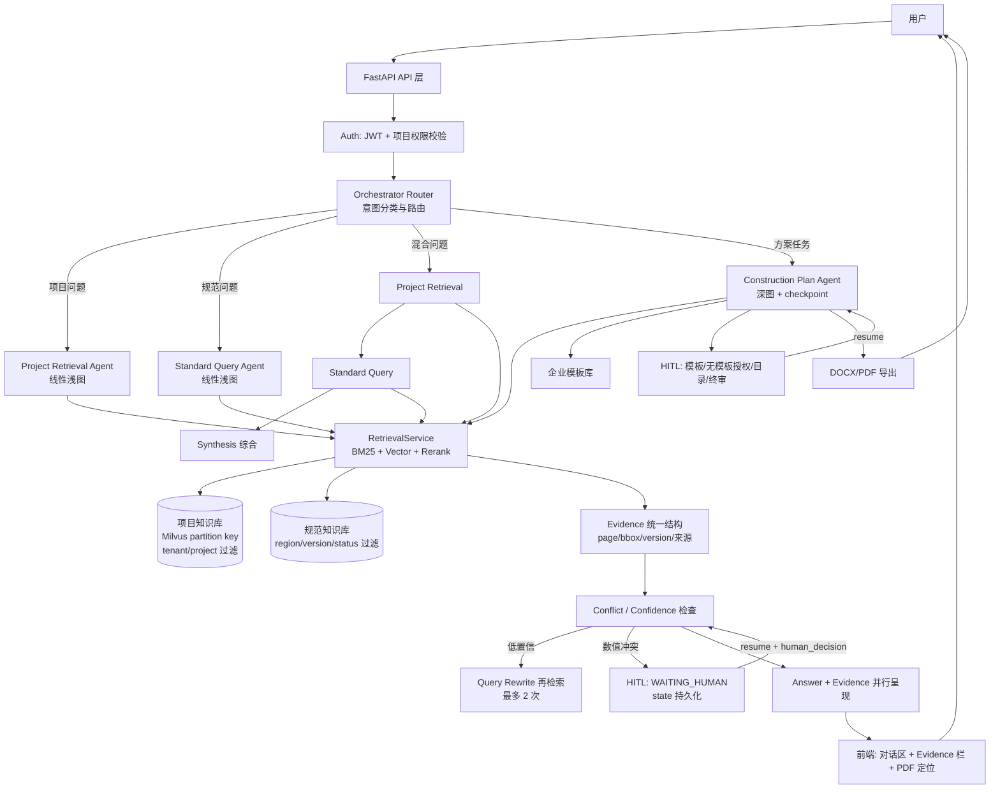

# ConstructionAgent 第二轮：GitHub 技术调研反向验证报告

> 验证日期：2026-08-15
> 验证人角色：技术尽调 / 反向验证工程师
> 验证方法：GitHub 源码文件级核对（raw.githubusercontent.com）+ 官方文档核对（milvus-docs v3.0.x 分支）+ LICENSE 原文核对 + 仓库页面核对
> 证据等级：S=源码+文档双验证 ｜ A=源码验证 ｜ B=官方文档验证 ｜ C=README/项目描述 ｜ D=第三方文章 ｜ E=推测

---

## 〇、验证执行记录（本轮实际做了什么）

| 验证对象 | 验证方式 | 证据等级 | 结果 |
| --- | --- | --- | --- |
| LangGraph interrupt() / Command.resume | 源码 libs/langgraph/langgraph/types.py L851 / L799,L823 | S | 真实存在 |
| LangGraph StateGraph / add_conditional_edges / compile | 源码 libs/langgraph/langgraph/graph/state.py L131 / L982 / L1177 | S | 真实存在 |
| LangGraph checkpoint-postgres 包 | 源码 libs/checkpoint-postgres/langgraph/checkpoint/postgres/__init__.py | S | 真实存在 |
| LangGraph create_react_agent | 源码 libs/prebuilt/langgraph/prebuilt/chat_agent_executor.py L278 | S | 真实存在 |
| Milvus BM25 实现方式 | 官方文档 full-text-search.md（v3.0.x） | B | 内置 Function（analyzer→稀疏向量→BM25 打分），非外部组件 |
| Milvus chinese 分词器 | 官方文档 analyzer-overview.md | B | 存在（专为中文分词），另有 pinyin/cnalphanumonly 过滤器 |
| Milvus Partition Key 定位 | 官方文档 use-partition-key.md | B | 官方定义为 search optimization solution，hash 分区+查询裁剪，未声称任何安全属性 |
| Milvus 3.0 BM25/稀疏索引演进 | 官方 release_notes.md | B | SINDI / Block-Max WAND 等，BM25 为成熟持续演进功能 |
| RAGFlow rag/app/laws.py 切片机制 | 源码 L168~L300 | S | 真实机制=解析器输出层级sections→剔除目录→冒号转标题→bullets_category→tree_merge 层级树合并；.doc 走 Apache Tika（第一轮"条款级正则"说法不准确） |
| RAGFlow deepdoc/parser/pdf_parser.py | 源码 L42~L89 | S | 组件化封装：OCR/LayoutRecognizer/TableStructureRecognizer 来自 deepdoc.vision；parser 可插拔（DeepDOC/mineru/paddleocr/docling） |
| PyMuPDF License | 仓库页面 | A | AGPL-3.0 / 商业双许可（官方自述 AGPL build or the commercial build）——第一轮遗漏 |
| MinerU License | LICENSE.md 原文 | S | Apache-2.0 + 附加条款：MAU>1亿 或 月收入>2000万美元需商业授权；在线服务必须署名——第一轮定性偏严，需修正 |
| pdfplumber / pypdf License | LICENSE 原文 | A | MIT / BSD-3-Clause——PyMuPDF 的合规备胎 |
| FlagEmbedding BGE-M3 三通道 + Reranker 线 | 官方 README | A | dense+sparse+colbert 确认；bge-reranker-v2-m3/minicpm-layerwise/gemma2 确认 |
| Qwen3-Embedding / Reranker（0.6B/4B/8B） | 官方 README | C | 存在；8B 版 MTEB 多语榜 No.1（2025-06）；100+ 语言；32K |
| bm25s 纯 Python BM25 | 官方 README | C | 确认（NumPy/SciPy 稀疏矩阵，有论文） |
| PaddleOCR ppstructure/ 目录 | 仓库页面 | A | 存在 |
| milvus-docs 仓库结构 | GitHub contents API | S | 路径已迁移至 site/en/，默认分支 v3.0.x（第一轮引用路径失效，不影响结论） |

---

## 一、10 个核心结论逐条验证

### 结论 1：LangGraph 作为 V1 编排框架 → 部分成立，修正为「强烈推荐（限定用法）」

**A. 是否真的需要？**
三个 Agent 中：Project/Standard 是「检索→重排→证据→回答」线性管线 + 一条低置信分支，用图表达收益有限；Construction Plan Agent 有 4~5 个 HITL 挂起点 + 分章节生成 + 断点恢复，是真正的状态机问题。
纯 Python + PostgreSQL 状态机完全可以替代，但要自研 checkpoint 语义、状态版本、resume 重放——这几百行代码的隐性成本在状态演化时才暴露。

**B. 哪些能力真实解决 ConstructionAgent 问题（S 级验证）**：

| Repository → 文件 → 类/函数 | 作用 | 对应需求 |
| --- | --- | --- |
| langchain-ai/langgraph → libs/langgraph/langgraph/graph/state.py → StateGraph(L131) / add_conditional_edges(L982) / compile(L1177) | 状态图 + 条件路由 | 三张 Agent 图 + 低置信分支 |
| langchain-ai/langgraph → libs/langgraph/langgraph/types.py → interrupt()(L851) / Command(L799, resume L823) | 挂起等待人工输入 / 携带决策恢复 | HITL 4+1 节点 |
| langchain-ai/langgraph → libs/checkpoint-postgres/langgraph/checkpoint/postgres/__init__.py | 状态持久化到 PostgreSQL | Task Resume（01 文档 §40） |
| langchain-ai/langgraph → libs/prebuilt/langgraph/prebuilt/chat_agent_executor.py → create_react_agent(L278) | Tool 调用循环 | Agent Tool 封装 |

**C. 对比**：LlamaIndex Workflow（事件驱动，HITL/checkpoint 弱）、Haystack Pipeline（管线而非状态机，无原生 interrupt-resume）、CrewAI（黑盒 Prompt）均不满足「挂起-持久化-恢复」硬需求。LangGraph 是唯一把这三件事做进核心 API 且源码验证通过的框架。

**D. 最终判定**：**强烈推荐（不是"必须"）**。约束：① 冻结版本号；② Project/Standard 用浅图；③ Checkpointer Day 1 接 PostgreSQL；④ 不用 Function API 等新特性。备选（无框架 + PG 状态机）保留为自维护选项，不作默认。

---

### 结论 2：Milvus 作为 V1 Vector Store → 成立（standalone 形态），两处表述必须修正

**1. BM25 验证（B 级）**：官方文档确认 BM25 全文检索是 Milvus 内置能力——enable_analyzer=True 的 VARCHAR/TEXT 字段 → analyzer 分词 → 内置 BM25 Function 生成稀疏向量 → 查询时 BM25 打分。**不是外部组件**（底层引擎 tantivy，对用户是内置 Function）。版本引入（2.5，2024-12）来自训练知识，本轮文档未直接找到版本标注，**标为 B 级未完全验证**。
中文适配：官方确认存在 chinese analyzer 及 pinyin/cnalphanumonly 过滤器；**是否支持自定义词典（建筑术语）未在文档中找到——列入结果 6 待实验**。

**2. Partition Key 验证（B 级，推翻第一轮表述）**：官方文档原文定义——The Partition Key is a search optimization solution based on partitions, narrowing the search scope and improving search efficiency。机制：写入时按 PK 值 hash 路由到固定数量分区；**查询时只有 filter 带了 PK 条件才裁剪范围；不带条件=扫全部分区**。文档未声称任何权限/安全属性。
**修正结论**：Partition Key = 查询路由 + 性能优化 + 逻辑数据分隔，**不是安全边界**。权限安全 = Service 层鉴权（JWT→tenant→project）+ 检索请求强制注入 project filter（冻结文档 01 §25 的「先 Metadata Filter 再检索」是正确且必须的），Partition Key 只作该 filter 的性能加速器，可加 Milvus RBAC 作纵深。**第一轮"物理安全隔离"说法错误，正式推翻。**

**3. 三库对比（仅限 V1 需求）**：

| 能力 | Milvus | Qdrant | OpenSearch |
| --- | --- | --- | --- |
| Dense+Sparse+BM25 一库搞定 | ✓ | ✓（sparse 生成中文弱） | ✓（kNN+BM25，ik 最成熟） |
| 中文 BM25 成熟度 | 新（2.5 起，词典可控性未知） | 弱 | 最强 |
| V1 运维重量 | 中（standalone 单二进制） | 轻 | 重（JVM 集群） |
| 多租户过滤 | partition key+标量过滤 | payload 过滤 | filter context |
| License | Apache-2.0 | Apache-2.0 | Apache-2.0 |

**判定**：Milvus 保持 V1 主选（**锁 standalone/milvus-lite，禁集群**）；OpenSearch 仅在「中文 BM25 实测严重不达标 + bm25s 不满足」时作后手；Qdrant 为整体备选（触发条件=变更评审）。

---

### 结论 3：BGE-M3 + Reranker → 成立（作为默认），但必须做 A/B 实测

**逐查询类型分析**：

| 真实查询类型 | Dense 向量 | BM25 | BGE-M3 Sparse | Reranker |
| --- | --- | --- | --- | --- |
| 剪力墙水平分布筋最小配筋率是多少？（语义/描述型） | 强 | 中（切词后匹配弱） | 强 | 精排兜底 |
| GB 55037 第 X 条要求是什么？（精确编号） | 中 | **强**（倒排精确匹配） | 中（学习型权重对编号不可预测） | 精排兜底 |
| A-205 图纸这个位置什么构造？（图号定位） | 中 | **强** | 中 | 精排兜底 |
| 地下室外墙防水做法有哪些？（术语密集） | 强 | 中（专业词切分风险） | 强 | 精排兜底 |
| 模板支撑体系有什么要求？（跨文档综合） | 强 | 弱 | 中 | 精排兜底 |

**判定**：建筑检索查询里精确编号/图号/材料型号占比高，BM25 的确定性不可替代；BGE-M3 sparse 是学习型词项权重，对精确编号的确定性不如真 BM25。
**方案 A（Dense + BM25 + Reranker）为主选**；BGE-M3 Sparse 作可选第三通道（成本≈零，实测后决定去留）。
**约束**：BGE-M3 是默认不是终点——Qwen3-Embedding-0.6B / Qwen3-Reranker-0.6B（官方 README 确认存在）必须在知识库阶段用真实语料 A/B。模型切换成本低（向量库不变，重建索引即可）。

---

### 结论 4：PyMuPDF + PaddleOCR + MinerU 分层解析 → 框架成立，License 结论重大修正

**重大发现（第一轮遗漏）**：PyMuPDF 是 **AGPL-3.0 / 商业双许可**（官方自述 AGPL build or the commercial build）。AGPL 对网络服务有传染性约束——若 ConstructionAgent 以 SaaS 形态交付，需要法务决策：接受 AGPL / 购买商业授权 / 换 pypdf+pdfplumber+pypdfium2 组合（MIT/BSD，渲染缩略图可用 pypdfium2 替代，功能有折损）。
**MinerU License 修正**：实为 **Apache-2.0 + 附加条款**（MAU≤1亿 且 月收入≤2000万美元可免费商用；提供在线服务必须署名）。比第一轮说法宽松，但署名义务必须写进产品。

**Parser Router 设计验证（不推翻，补决策点）**：

```
文件 → 类型识别
 ├─ 文本型 PDF → PyMuPDF（若 AGPL 不通过 → pypdf/pdfplumber）
 ├─ 扫描 PDF → PaddleOCR PP-Structure（独立容器，避免 Paddle/Torch 同镜像）
 ├─ 复杂版面兜底 → MinerU（Apache-2.0+署名，按需启用）
 ├─ .docx → python-docx
 ├─ .xlsx → openpyxl（表格→结构化 chunk 走专属通道）
 └─ .doc（WPS 老格式）→ LibreOffice headless 转 PDF → 走 PDF 管线
       （RAGFlow 自己用 Tika 兜底 .doc——源码 L241~L258 验证，行业通病）
```

**判定**：分层 Router 架构成立；新增两个必做决策：PyMuPDF License 决策、MinerU 署名义务落地。

---

### 结论 5：RAGFlow 只学 DeepDoc → 成立，但「学什么」要修正

源码验证后的诚实修正：第一轮说 laws.py 是「按编-章-节-条-款层级切分」，**实际机制不是条款级正则**：解析器输出带层级位置的 sections → remove_contents_table（剔除目录）→ make_colon_as_title → bullets_category → tree_merge（层级树合并，深度2）→ tokenize_chunks。即「**目录剔除 + 层级树合并 + 按层级切片**」，条款结构由 pdf_parser 的层级识别承载。

| RAGFlow 模块 | 是否研究 | 原因（证据） |
| --- | --- | --- |
| DeepDoc 解析框架（deepdoc/parser/pdf_parser.py） | ✅ 研究 | OCR/Layout/Table 组件化封装 + parser 可插拔，DocumentService 的架构范本（S级） |
| Chunking（rag/app/laws.py） | ✅ 研究 | 目录剔除 + tree_merge 层级切片是规范文档切片正确思路（S级）；.doc 它也靠 Tika |
| OCR / Layout / Table（deepdoc/vision/） | ⚠️ 只学封装方式 | 底层模型用 PaddleOCR 系，不引入 RAGFlow 自研模型（权重许可未核） |
| Retrieval（rag/nlp 术语加权/同义词） | ✅ 借鉴思想 | 用于 Query Rewrite 节点（C级，未源码深核） |
| Citation | ✅ 借鉴结构 | chunk_id+position 元数据与 Evidence 同构（C级） |
| GraphRAG（graphrag/） | ❌ V1 不学 | V2 规范关联图谱再评估 |
| Agent 画布 / Memory / MCP | ❌ 不学 | 自研 DSL，与 LangGraph 冲突 |

---

### 结论 6：图纸视觉 → 维持 V2，但明确三层拆分

| 层 | 内容 | V1 判定 | 理由 |
| --- | --- | --- | --- |
| L0 文本层提取 | CAD 导出 PDF 文字层 + 标题栏 OCR | **V1 做** | 零模型成本，满足「检索项目图纸」DoD 基础 |
| L1 页级视觉检索 | ColPali 类页面图像检索 | **按语料触发** | 扫描件占比高时 L0 不够；成本=建索引+GPU 编码，非几何推理 |
| L2 符号/几何理解 | 构件检测、连接图、量算 | **V2** | 成本高（检测+关系模型）、需领域数据集与标注、准确率风险大（ConstructDrawingAI 基准 mAP 0.6~0.93 分专业波动）、V1 主链路不需要 |

**判定**：第一轮「图纸视觉一律 V2」过于一刀切，修正为 L0 必做 / L1 按语料 / L2 坚决 V2。

---

### 结论 7：HITL 节点 → 4+1 节点成立，场景 C/D 明确不 HITL

| 场景 | 是否 HITL（挂起等待） | 判定理由 |
| --- | --- | --- |
| A. 企业模板确认 | ✅ 必须 | 格式来源决定整篇方案，高杠杆低频 |
| A'. 无模板时授权通用结构 | ✅ 必须 | 01 §33 已定义，补为显式节点（第5个） |
| B. 方案目录确认 | ✅ 必须 | 结构决定内容组织 |
| C. 工程数据冲突 | ✅ 必须 | 安全底线，LLM 禁止自选 |
| D. 最终方案审核 | ✅ 必须 | 工程签字文化，最终把关 |
| E. 规范检索置信度不足 | ❌ 不 HITL | 展示证据+适用性提示+「无法确认有效状态」说明即可；挂起会把查询变审批 |
| F. 检索不到资料 | ❌ 不 HITL | 返回推荐文件清单+人工查询入口（轻提示，不挂状态） |

**补充三项缺失策略**：① WAITING_HUMAN 超时 TTL 与提醒策略（当前文档空白）；② human_decision 的 schema 定义（模板选择/目录修改/终审意见各自结构）；③ 规范冲突归口：纯问答→并列展示双方证据；被 Plan Agent 消费→强制进入终审风险清单。

---

### 结论 8：三 Agent 架构 → 成立

**为什么不是一个**：单一 Agent 的 State 需同时容纳项目过滤（tenant/project）与规范维度（region/version/status）两套正交元数据体系；冲突校验规则不同（项目=数值冲突，规范=版本/适用性冲突）；Prompt 规则集不同；测试维度不同（TC-P vs TC-S）。合并唯一收益是少一个路由，代价是状态与测试爆炸（00 §9 论述依然成立）。
**为什么不是更多**：V1 三个业务场景对应三个能力单元，已到「业务职责」粒度；继续拆是框架炫耀，无业务价值。
**Project/Standard 是否该拆（重点检查）**：拆。理由不是流程不同，而是**检索域与校验规则不同**。混合问题（「地下室防水怎么做」）的正确解法不是合并 Agent，而是 **Orchestrator 顺序路由：Project Retrieval → Standard Query → Synthesis**（02 §11 场景三已定义，本轮确认成立），Synthesis 是 Orchestrator 层的组合步骤，不需要第四个 Agent。

---

### 结论 9：过度设计检查 → 第一轮确实存在过度设计，按四档裁减

**V1 必须**：
1. 认证 + tenant/project 权限过滤
2. 三类知识库 + DocumentParser Router 解析管线
3. 混合检索（BM25+向量+重排，BM25 通道实验后定）
4. Evidence 统一结构 + 前端证据栏 + PDF 页码定位
5. Project / Standard 两 Agent（线性浅图）
6. Construction Plan Agent（HITL + checkpoint）
7. DOCX/PDF 导出

**V1 推荐**：
1. 冲突检测 + 低置信 Query Rewrite（规则版）
2. SSE 流式（短查询不建 Task）
3. Task 化仅限 Plan Agent
4. 检索评估（Ragas 或自建小测试集）
5. LLMFactory 多 provider 抽象

**V1 暂缓**：GraphRAG/知识图谱、MCP、ColPali（按语料触发，默认暂缓）、Letta 式记忆、Milvus 集群、拖拽式方案编辑器、多 LLM 动态路由。

**V2 再考虑**：图纸符号检测与 CIR 管线（ConstructDrawingAI）、CAD Agent（cad-ai-agent）、量算 MCP（OpenTakeoff）、ezdxf/IfcOpenShell、Qwen2.5-VL 图纸 VLM、规范关联图谱、长记忆、BIM、造价/进度/质量 Agent。

---

### 结论 10：Top 15 重审 → 见结果 2（逐项目证据等级标注）

---

## 结果 1：第一轮结论审判

| 第一轮结论 | 是否成立 | 证据等级 | 修改意见 |
| --- | --- | --- | --- |
| LangGraph 必须采用 | **部分成立** | S | 降为「强烈推荐（限定用法）」：版本冻结、浅图、checkpoint Day1；备选=无框架+PG 状态机 |
| Milvus 最适合 | **部分成立** | B | 锁 standalone/milvus-lite；「Partition Key=物理安全隔离」**推翻**（官方定义为性能优化）；BM25 中文适配需实验 |
| BGE-M3 + Reranker | **成立（默认非终点）** | A | 保留为默认；知识库阶段必须与 Qwen3-Embedding/Reranker-0.6B 做 A/B；BM25 通道用方案 A（真 BM25 优先于 sparse） |
| PyMuPDF + OCR + MinerU | **框架成立，License 修正** | S | 补充：PyMuPDF=AGPL-3.0 双许可（第一轮遗漏，需法务决策）；MinerU=Apache-2.0+署名义务（比原说法宽松） |
| RAGFlow 只学 DeepDoc | **成立** | S | 「学什么」修正：laws.py 是目录剔除+层级树合并，非条款正则；vision 只学封装方式不引模型 |
| 图纸视觉 V2 | **部分成立** | C | 拆三层：L0 文本提取 V1 必做 / L1 页级视觉按语料触发 / L2 符号几何坚决 V2 |
| 三 Agent | **成立** | B | 维持；混合问题用 Orchestrator 顺序路由+Synthesis，不增不减 Agent |
| HITL | **成立** | B | 4+1 节点维持；补三项策略：超时 TTL、human_decision schema、规范冲突归口 |

---

## 结果 2：GitHub 项目最终分类

### 🟢 必须研究（5 个）

| 项目 | 分类理由 | 证据等级 |
| --- | --- | --- |
| LangGraph | 唯一具备 interrupt/checkpoint/resume 三合一且源码验证的编排框架 | S |
| Milvus + pymilvus | 冻结架构；BM25 内置（官方文档）；partition key 性能优化 | B |
| FlagEmbedding（BGE） | BGE-M3 三通道 + reranker 产品线齐全，MIT | A |
| PaddleOCR / PP-Structure | 中文版面/表格/OCR 第一梯队，Apache-2.0 | A |
| RAGFlow（仅源码学习） | laws.py/pdf_parser.py 源码验证有直接借鉴价值 | S |

### 🟡 值得参考（8 个）

| 项目 | 参考点 | 证据等级 |
| --- | --- | --- |
| Dify | HITL 产品交互、任务挂起-恢复 API 设计（License 受限，不采用本体） | C |
| LlamaIndex | Parent-Child 检索、MetadataFilters 设计 | C |
| Haystack | BM25+向量双路合并的工程实现 | C |
| bm25s | 纯 Python BM25 备胎（含自定义词典方案） | C |
| MinerU | 复杂版面兜底解析器（Apache-2.0+署名） | S（License）/C（能力） |
| ColPali | 页级视觉检索（V1 按语料触发 / V2 主力） | C |
| Qwen3-Embedding | Embedding/Reranker A/B 评测对手方 | C |
| Letta | 记忆分层与状态持久化思想（V2 评估） | C |

### ⚪ 了解即可（5 个）

| 项目 | 原因 |
| --- | --- |
| QAnything | 停滞 17 个月 + AGPL-3.0，仅参考两段式检索设计 |
| Docling | IBM 文档转换，中文弱于国产方案，与 MinerU/PaddleOCR 重叠 |
| Qdrant | Milvus 备选（触发条件=变更评审），轻量但偏离冻结架构 |
| ConstructDrawingAI | 研究级项目，V2 图纸方向思想供应商（CIR 分层），V1 不碰 |
| OpenTakeoff | 量算 MCP 案例，V2 再评估 MCP 价值的标本 |

### 🔴 淘汰

| 项目 | 淘汰原因 |
| --- | --- |
| CRAG | 无 License（不可抄代码）；Web Search 回退与我们的人工兜底路线不符 |
| self-rag | 学术 Demo，实现停留在 Llama2 时代 |
| AutoGen | 并入 Microsoft Agent Framework，生态动荡期，License 混乱（CC-BY 仓库级） |
| MetaGPT | 活跃度下降（2026-01 后放缓），软件开发场景与建筑业务错配 |
| deepdoctection | 与 PaddleOCR PP-Structure 重叠且综合能力更弱 |
| marker / surya | 与 MinerU/PaddleOCR 重叠，中文能力无优势 |
| 其余低星图纸项目 | engineering-drawing-extractor（2023 停滞）/ YOLOplan（无 License，过早期） |

---

## 结果 3：ConstructionAgent V1 技术选型

| 技术领域 | 最终选择 | 备选 | 为什么（证据等级） |
| --- | --- | --- | --- |
| Agent 编排 | LangGraph（版本冻结，浅图策略） | 无框架 + PG 状态机 | interrupt/checkpoint/resume 源码验证（S） |
| Workflow | LangGraph StateGraph | LlamaIndex Workflow | 条件路由 + 持久化（S） |
| Embedding | BGE-M3（默认） | Qwen3-Embedding-0.6B | 三通道 + 中文成熟（A）；A/B 后定 |
| Vector DB | Milvus standalone/milvus-lite | Qdrant | 混合检索内置 + 冻结架构（B）；禁集群 |
| Sparse / BM25 | **待实验**：Milvus FTS(chinese) vs bm25s+自定义词典 vs BGE-M3 sparse | OpenSearch ik（后手） | 三者证据均不足以定论（B/C） |
| Reranker | bge-reranker-v2-m3 | Qwen3-Reranker-0.6B | 轻量易部署（A）；A/B 后定 |
| PDF 文本 | PyMuPDF（待法务 AGPL 决策） | pypdf/pdfplumber + pypdfium2 | AGPL 双许可（A）；备胎 MIT/BSD（A） |
| OCR/版面/表格 | PaddleOCR PP-Structure（独立容器） | RapidOCR（ONNX 轻通道） | 中文第一梯队（A） |
| Word | python-docx + LibreOffice 转 PDF 兜底 | - | .doc 老格式必须转 PDF（B 级：RAGFlow 同法） |
| Excel | openpyxl | - | 结构化表格直出 chunk |
| Redis | 短期上下文 + 缓存 + 分布式锁 | - | 冻结架构 |
| PostgreSQL | 业务数据 + Task 状态 + LangGraph checkpoint | - | 一库三用，减组件 |
| LLM | DeepSeek / Qwen 云 API（LLMFactory 静态配置） | 本地模型（V2） | 冻结架构 |

---

## 结果 4：V1 / V2 边界

### V1 必须实现（10 项）
1. 登录认证 + tenant/project 权限过滤（JWT+bcrypt）
2. 三类知识库（项目/规范/企业）+ DocumentParser Router 解析管线
3. 混合检索（BM25+向量+重排，BM25 通道按实验结果定）
4. Evidence 统一结构（page/bbox/版本/来源）+ 前端证据栏 + PDF 页码定位
5. Project Retrieval Agent（冲突检测、低置信兜底）
6. Standard Query Agent（版本/适用性检查）
7. Construction Plan Agent（模板→目录→分章节→四查→终审）
8. HITL 4+1 节点 + Task Resume（checkpoint-postgres）
9. SSE 流式（短查询不 Task 化；仅 Plan Agent 长任务 Task 化）
10. DOCX/PDF 导出

### V1 暂时不做（10 项）
1. 图纸符号/几何检测（L2）
2. CAD/BIM 原生解析
3. ColPali 视觉检索（默认暂缓，语料触发则提前）
4. GraphRAG / 知识图谱
5. MCP 生态
6. Letta 式复杂记忆
7. Milvus 集群模式
8. 拖拽式方案编辑器
9. 多 LLM 动态路由
10. 规范有效性联网更新

### V2 再研究
ColPali 图纸检索、ConstructDrawingAI CIR 管线、cad-ai-agent、OpenTakeoff MCP 量算、ezdxf/IfcOpenShell、Qwen2.5-VL 图纸 VLM、规范关联图谱（RAGFlow graphrag 参考）、Letta 记忆分层、多租户 Milvus 集群、造价/进度/质量 Agent。

---

## 结果 5：最终架构草案



**State 流转说明**：
- 三个独立 State（ProjectRetrievalState / StandardQueryState / ConstructionPlanState），Orchestrator 只做路由不共享 State；
- Construction Plan Agent 通过 ProjectRetrievalService / StandardRetrievalService 获取 Evidence，**不嵌套调用另两个 Agent 的图**；
- HITL 挂起时 State 由 PostgresCheckpointer 持久化，resume 时从断点继续（interrupt → Command(resume=human_decision)）；
- 短查询（Project/Standard）走 SSE 流式直接返回，不建 Task；长任务（Plan）Task 化 + 事件流。

---

## 结果 6：仍然无法确定的问题（最重要）

> 以下问题即使经过两轮调研仍无可靠证据，**不强行给答案**，全部转为知识库阶段的实验任务。

| # | 无法确定的问题 | 需要的实验 | 需要的数据 |
| --- | --- | --- | --- |
| 1 | 中文建筑语料下 BM25 通道选型：Milvus FTS(chinese analyzer) vs bm25s+jieba自定义词典 vs BGE-M3 sparse | 三通道在同一语料上测 recall@k / MRR | 3~5 本规范 PDF + 项目文档 + 50~100 条真实查询（含精确图号/规范编号/材料术语） |
| 2 | Milvus chinese analyzer 是否支持自定义词典（建筑术语切分质量） | 官方文档未验证到；需实测「聚氨酯防水涂膜」「等电位联结」等术语的索引与召回 | 建筑术语表（可自 02 文档与样本 .doc 提取） |
| 3 | Embedding/Reranker 最终选型：BGE-M3 vs Qwen3-Embedding-0.6B；bge-reranker-v2-m3 vs Qwen3-Reranker-0.6B | A/B 评测：命中率/NDCG + 推理延迟 | 同 #1 测试集 |
| 4 | PyMuPDF AGPL 的商用合规决策 | 法务评估（非技术实验） | 交付形态定义（SaaS/私有化） |
| 5 | WPS 老式 .doc 转 PDF 的保真度与提取质量 | LibreOffice headless 实测转换 + 文本/表格提取对比 | 现有《建筑电气工程施工方案.doc》样本 |
| 6 | HITL resume 全链路行为：多轮挂起/恢复、超时、并发 | LangGraph checkpoint-postgres POC（原型验证，非正式开发） | - |
| 7 | 混合问题中「项目值 vs 规范值」结构化抽取准确率（数值/单位/条款） | LLM 结构化抽取在建筑语料上的错误率评估 | 30~50 条人工标注的对比样例 |
| 8 | 扫描图纸 OCR 后检索质量下限（决定 ColPali 是否提前进 V1） | 对扫描件建 OCR 索引后测检索命中率，设定触发阈值 | 扫描图纸样本（可来自真实项目） |

---

*本轮验证遵守「不默认第一轮正确、不猜测、区分事实/推断/推荐」原则：源码级验证 5 组（S 级），官方文档级验证 3 组（B 级），推翻或修正第一轮表述 5 处（Partition Key 安全隔离、MinerU License 定性、laws.py 机制描述、PyMuPDF License 遗漏、图纸视觉一刀切）。*
